# Manual de Uso — Rotina de Estoque

## 1. Apresentação

Este manual explica como utilizar a rotina de estoque do WebCaixa para
controlar:

- Produtos destinados à venda;
- Produtos de limpeza e beleza;
- Materiais de escritório;
- Embalagens e descartáveis;
- Itens de consumo interno;
- Solicitações enviadas pelos estúdios ao almoxarifado;
- Envio, recebimento e divergências dos pedidos;
- Entradas, saídas, ajustes e histórico.

O manual está separado por perfil:

- **Administrador/Almoxarifado**;
- **Auditoria**;
- **Encarregada**;
- **Caixa**.

> **Importante:** as telas atuais utilizam dados fictícios e servem para
> validação da interface e dos fluxos. Enquanto a integração com o banco não
> estiver concluída, nenhuma ação demonstrativa alterará o estoque real.

---

## 2. Visão geral da interface

A rotina segue o padrão visual do `PhotoVippCloud_ERP`.

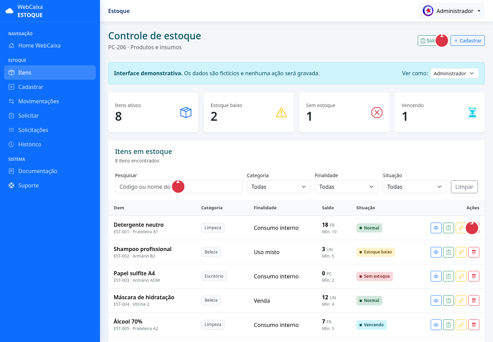

Na imagem:

1. **Ações rápidas:** permitem solicitar ou cadastrar, conforme o perfil;
2. **Pesquisa e filtros:** localizam os itens sem alterar os dados;
3. **Ações do item:** visualizar, solicitar, editar ou inativar.

### 2.1 Menu lateral

O menu azul, localizado à esquerda, apresenta apenas as opções permitidas para
o perfil autenticado.

As principais opções são:

- **Itens:** abre a listagem geral;
- **Cadastrar:** cria um item;
- **Movimentações:** registra entrada, saída, ajuste ou devolução;
- **Solicitar:** cria uma solicitação;
- **Solicitações:** acompanha os pedidos;
- **Histórico:** consulta movimentações;
- **Documentação:** abre o material de apoio;
- **Suporte:** direciona para atendimento técnico.

Em celulares, o menu fica recolhido e pode ser aberto pelo botão de menu no
topo da página.

### 2.2 Barra superior

A barra branca superior mostra:

- Nome da rotina aberta;
- Foto ou identificação do usuário;
- Perfil utilizado;
- Menu da conta e opção de saída.

### 2.3 Indicadores

Os cartões do painel resumem:

- Total de itens ativos;
- Itens abaixo do estoque mínimo;
- Itens sem estoque;
- Itens próximos do vencimento.

### 2.4 Pesquisa e filtros

Na listagem, o usuário pode pesquisar pelo código ou nome do item e aplicar
filtros de:

- Categoria;
- Finalidade;
- Situação.

O botão **Limpar** remove os filtros e exibe novamente todos os itens.

### 2.5 Situações dos itens

| Situação | Significado |
|---|---|
| Normal | Quantidade disponível acima do estoque mínimo |
| Estoque baixo | Quantidade igual ou inferior ao mínimo definido |
| Sem estoque | Quantidade disponível igual a zero |
| Vencendo | Existe lote próximo da data de validade |
| Inativo | Item preservado no histórico, mas indisponível para novas operações |

---

## 3. Fluxo completo de uma solicitação

```text
Estúdio cria a solicitação
          ↓
Almoxarifado visualiza o pedido
          ↓
Almoxarifado analisa e aprova
          ↓
Itens entram em separação
          ↓
Almoxarifado registra o envio
          ↓
Estúdio visualiza que o pedido foi enviado
          ↓
Estúdio confere o recebimento
    ┌─────┴─────┐
    ↓           ↓
Sem diferença  Com diferença ou dano
    ↓           ↓
Concluído      Almoxarifado trata a divergência
                    ↓
                Concluído
```

Cada etapa deve registrar:

- Data e hora;
- Usuário responsável;
- Perfil ou setor;
- Quantidades envolvidas;
- Observações;
- Situação anterior e nova.

### 3.1 Estados possíveis

| Estado | Descrição |
|---|---|
| Pendente | Solicitação criada e aguardando o almoxarifado |
| Visualizada | Almoxarifado abriu o pedido |
| Em análise | Quantidades e disponibilidade estão sendo verificadas |
| Em separação | Itens aprovados estão sendo preparados |
| Enviado | Pedido saiu do almoxarifado |
| Recebido | Estúdio informou o recebimento |
| Com divergência | Quantidade ou condição recebida difere do envio |
| Concluído | Processo encerrado e conferido |
| Recusado | Solicitação não aprovada |
| Cancelado | Pedido cancelado antes do envio |

## 3.2 Como trabalhar diariamente com a rotina

### Início do dia — Administrador/Almoxarifado

1. Abra o painel e confira os indicadores;
2. Verifique itens zerados, baixos e vencendo;
3. Abra **Solicitações**;
4. Visualize os pedidos pendentes;
5. Analise e separe os materiais aprovados;
6. Registre cada envio no momento da saída;
7. Acompanhe divergências até a conclusão.

### Início do dia — Auditoria

1. Consulte alertas e histórico recente;
2. Verifique ajustes, perdas e divergências;
3. Acompanhe suas solicitações;
4. Confira fisicamente os materiais recebidos;
5. Informe diferenças sem alterar o histórico original.

### Início do dia — Encarregada

1. Consulte os itens antes de pedir;
2. Agrupe as necessidades do setor;
3. Crie uma solicitação clara;
4. Acompanhe visualização, aprovação e envio;
5. Conte e confira o pedido no recebimento.

### Início do dia — Caixa

1. Use a rotina apenas para consulta;
2. Confira disponibilidade quando necessário;
3. Não retire material diretamente;
4. Procure o responsável quando houver necessidade de reposição.

### Encerramento do dia — Almoxarifado

1. Confira se todo envio físico foi registrado;
2. Verifique pedidos enviados ainda não recebidos;
3. Trate divergências abertas;
4. Confira movimentações manuais;
5. Não deixe material separado sem situação registrada.

> **Regra de ouro:** o sistema deve refletir o que aconteceu fisicamente. Não
> marque como enviado antes da saída e não marque como recebido antes da
> contagem.

---

# Parte I — Administrador/Almoxarifado

## 4. Responsabilidades

O administrador representa o almoxarifado na simulação atual. Ele pode:

- Cadastrar e editar itens;
- Visualizar e inativar cadastros;
- Registrar movimentações;
- Consultar o histórico;
- Visualizar solicitações;
- Aprovar ou recusar pedidos;
- Separar e enviar itens;
- Conferir divergências informadas pelo estúdio.

## 5. Cadastrar um item

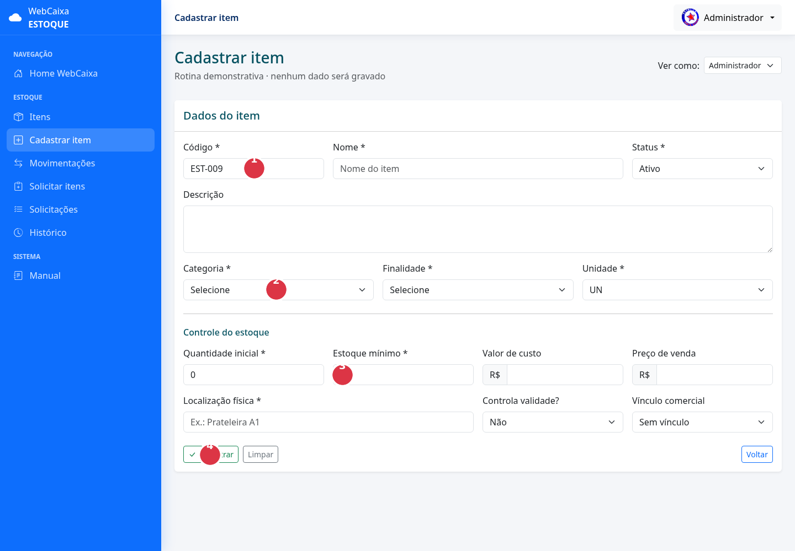

Use a imagem como sequência:

1. Informe código, nome e status;
2. Classifique o item por categoria, finalidade e unidade;
3. Defina quantidade inicial, estoque mínimo, custos e localização;
4. Revise os dados e clique em **Cadastrar**.

1. Acesse **Cadastrar** no menu lateral.
2. Informe o código único.
3. Digite o nome e a descrição.
4. Selecione categoria, finalidade e unidade.
5. Informe estoque inicial e estoque mínimo.
6. Informe valor de custo.
7. Informe preço de venda quando aplicável.
8. Defina a localização física.
9. Indique se o item possui controle de validade.
10. Clique em **Cadastrar**.

### 5.1 Finalidade

- **Venda:** aparece nas rotinas comerciais;
- **Consumo interno:** utilizado pelo estabelecimento;
- **Uso misto:** pode ser vendido e consumido internamente.

### 5.2 Cuidados

- Não reutilize códigos;
- Não cadastre o mesmo item mais de uma vez;
- Defina corretamente a unidade;
- Não use o cadastro para corrigir o saldo;
- Ajustes de quantidade devem ser feitos por movimentação.

## 6. Editar um item

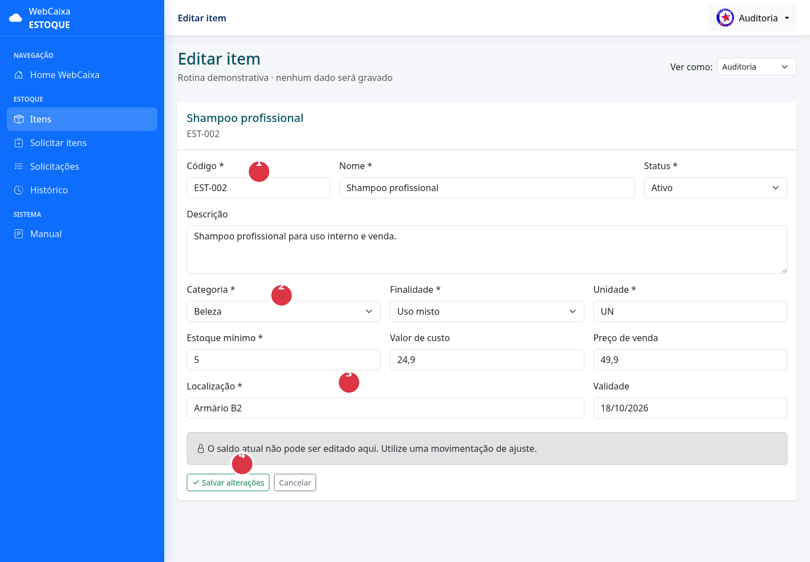

Na edição:

1. Confira se código e nome pertencem ao item correto;
2. Atualize classificação e finalidade somente quando necessário;
3. Revise estoque mínimo, valores e localização;
4. Salve. A quantidade disponível não deve ser alterada nessa tela.

1. Abra **Itens**.
2. Localize o cadastro.
3. Clique no botão com ícone de lápis.
4. Atualize os dados necessários.
5. Clique em **Salvar alterações**.

O saldo atual não poderá ser editado nessa tela.

## 7. Inativar um item

1. Localize o item.
2. Clique no botão vermelho com ícone de lixeira.
3. Confira código, nome e saldo.
4. Informe o motivo.
5. Marque a confirmação.
6. Clique em **Confirmar inativação**.

A inativação preserva o histórico. Um item movimentado não deve ser excluído
fisicamente do banco.

## 8. Registrar movimentações

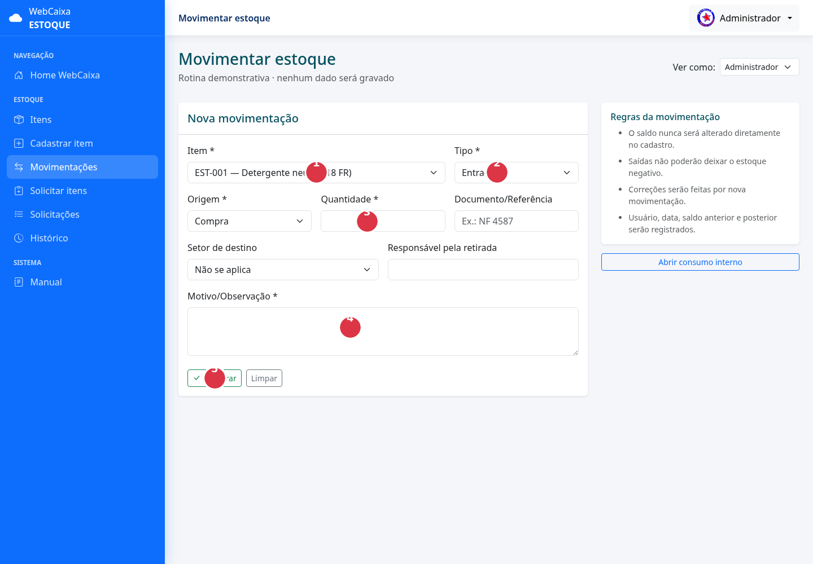

Preencha na ordem indicada:

1. Selecione o item;
2. Escolha o tipo da movimentação;
3. Informe origem, quantidade e documento;
4. Registre destino, responsável e motivo;
5. Confira e clique em **Registrar**.

Use **Movimentações** para:

- Entrada por compra;
- Saída manual;
- Ajuste de inventário;
- Devolução;
- Perda;
- Avaria;
- Descarte;
- Vencimento.

Informe:

- Item;
- Tipo;
- Origem;
- Quantidade;
- Documento ou referência;
- Setor, quando necessário;
- Responsável;
- Motivo.

Antes de confirmar uma saída, confira se existe saldo suficiente.

## 9. Visualizar solicitações

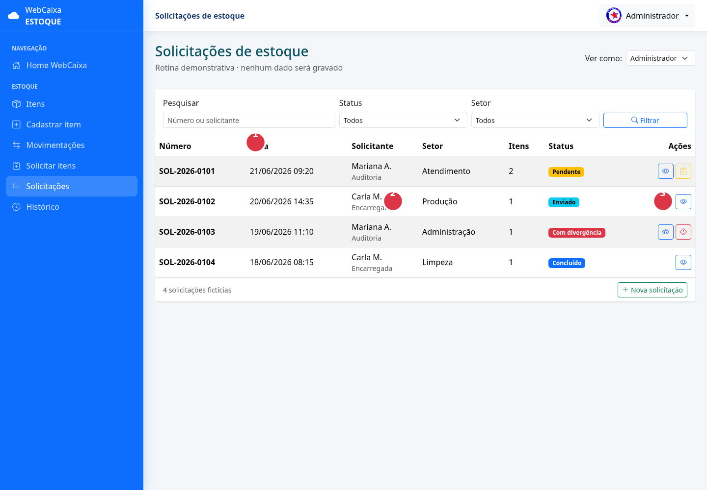

Na listagem:

1. Use os filtros para localizar pedidos;
2. Confira o status antes de agir;
3. Use os botões da última coluna para visualizar, analisar, enviar ou tratar
   divergências.

Na listagem, o almoxarifado poderá ver:

- Número;
- Data;
- Solicitante;
- Perfil;
- Setor;
- Quantidade de itens;
- Situação atual;
- Ações disponíveis.

### 9.1 Registro de visualização

Quando o almoxarifado abrir uma solicitação pendente, o sistema deverá
registrar:

- Quem visualizou;
- Data;
- Hora.

O estúdio verá a informação **Visualizada pelo almoxarifado** na linha do
tempo.

Abrir uma solicitação não significa aprová-la.

## 10. Analisar e aprovar

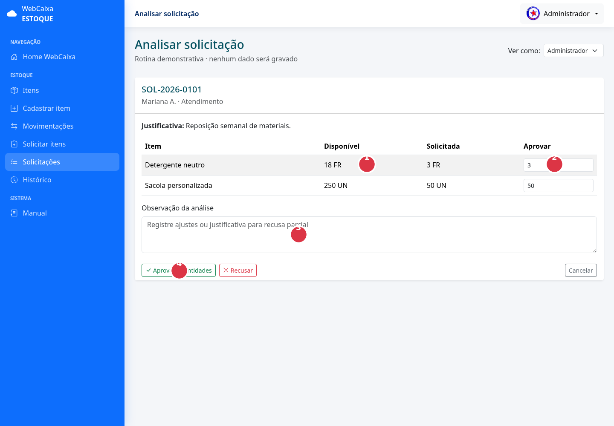

Na tela de análise:

1. Compare o saldo disponível;
2. Informe quanto será aprovado;
3. Registre a justificativa para ajustes ou aprovação parcial;
4. Aprove ou recuse o pedido.

1. Abra uma solicitação pendente.
2. Confira setor, justificativa e solicitante.
3. Compare quantidade solicitada com o saldo disponível.
4. Informe a quantidade aprovada de cada item.
5. Registre uma observação, se necessário.
6. Escolha **Aprovar quantidades** ou **Recusar**.

É permitido aprovar parcialmente.

Exemplo:

```text
Solicitado: 10 unidades
Disponível: 6 unidades
Aprovado: 6 unidades
```

## 11. Separar e enviar

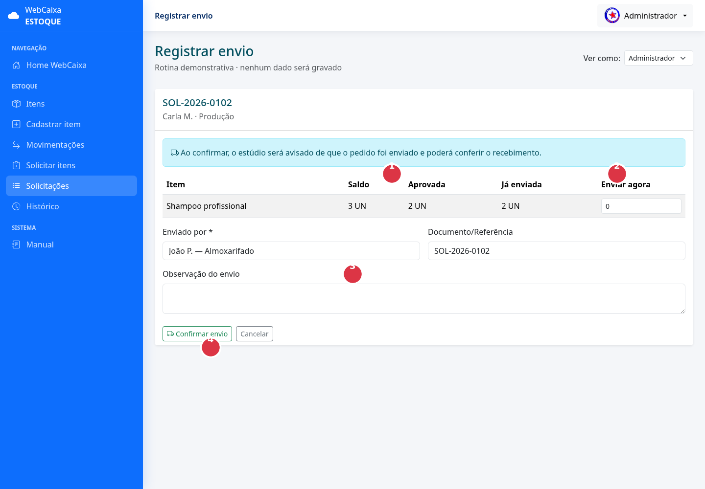

Antes do envio:

1. Confira o saldo e a quantidade aprovada;
2. Informe quanto está saindo fisicamente;
3. Identifique o responsável e registre observações;
4. Clique em **Confirmar envio** somente depois que o material estiver pronto
   para sair.

Após a aprovação:

1. Separe fisicamente os itens.
2. Confira código e quantidade.
3. Abra a opção de envio.
4. Informe quanto está sendo enviado.
5. Registre o responsável pelo envio.
6. Acrescente uma observação, se necessário.
7. Clique em **Confirmar envio**.

Depois disso:

- O pedido ficará como **Enviado**;
- O estúdio verá data, hora e responsável;
- O estúdio poderá confirmar o recebimento.

Não marque o pedido como enviado antes que ele saia fisicamente do
almoxarifado.

## 12. Tratar uma divergência

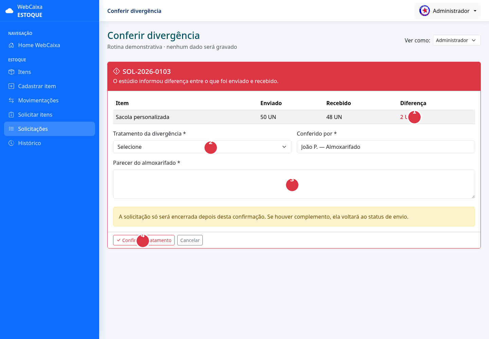

Na divergência:

1. Confira a diferença calculada;
2. Escolha o tratamento;
3. Registre um parecer detalhado;
4. Confirme o tratamento para atualizar estúdio e almoxarifado.

Uma divergência ocorre quando:

- A quantidade recebida é menor;
- A quantidade recebida é maior;
- Existe item danificado;
- A embalagem está violada;
- O item recebido é diferente.

Para tratar:

1. Abra a solicitação marcada em vermelho.
2. Compare enviado, recebido e diferença.
3. Escolha um tratamento:
   - Aceitar a quantidade recebida e encerrar;
   - Enviar o que faltou;
   - Registrar perda no transporte;
   - Solicitar devolução para conferência.
4. Informe um parecer.
5. Clique em **Confirmar tratamento**.

Se houver complemento, o pedido voltará ao fluxo de envio.

---

# Parte II — Auditoria

## 13. Responsabilidades

A auditoria pode:

- Listar e visualizar itens;
- Editar dados cadastrais;
- Consultar histórico;
- Criar solicitações;
- Acompanhar pedidos;
- Confirmar recebimento quando for o setor solicitante.

A auditoria não pode:

- Criar novos itens;
- Inativar itens;
- Aprovar a própria solicitação;
- Alterar diretamente o saldo;
- Registrar envio pelo almoxarifado.

## 14. Editar cadastros


Os números da imagem indicam a ordem segura: identificar o item, revisar sua
classificação, corrigir os dados permitidos e salvar. A auditoria não deve
usar essa tela para ajustar saldo.

Ao editar:

1. Confira se o item correto foi selecionado.
2. Atualize apenas informações cadastrais.
3. Não altere dados para esconder divergências.
4. Registre correções de saldo pelo histórico e movimentações apropriadas.

## 15. Consultar o histórico

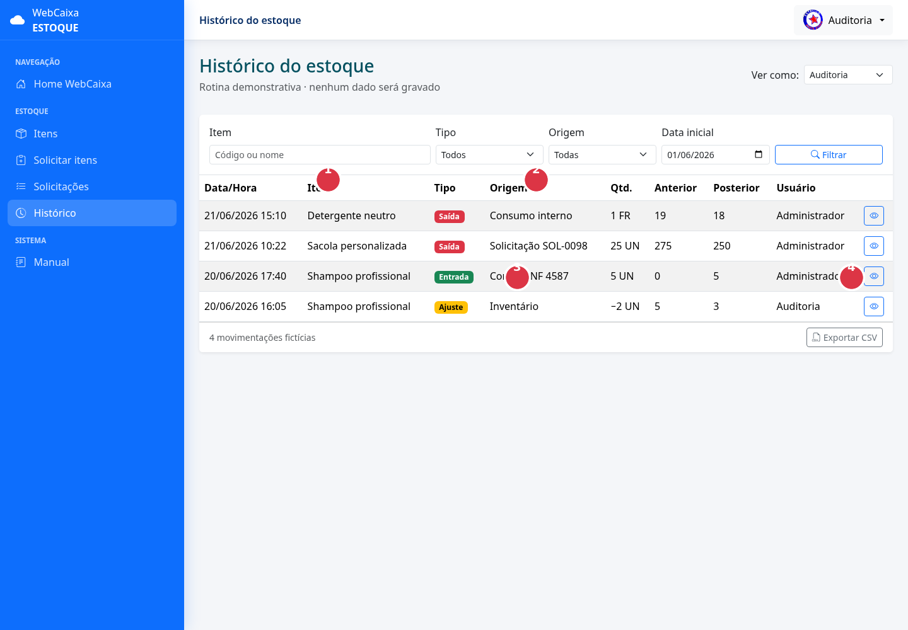

Na consulta:

1. Localize o item ou código;
2. Filtre tipo, origem e período;
3. Compare saldo anterior e posterior;
4. Abra os detalhes ou exporte para conferência.

Use **Histórico** para verificar:

- Entradas;
- Saídas;
- Ajustes;
- Devoluções;
- Usuário responsável;
- Saldo anterior;
- Saldo posterior;
- Origem da movimentação.

Ao encontrar uma inconsistência:

1. Registre a referência da movimentação;
2. Confira o pedido ou documento de origem;
3. Solicite correção por ajuste;
4. Não apague o evento original.

## 16. Criar uma solicitação

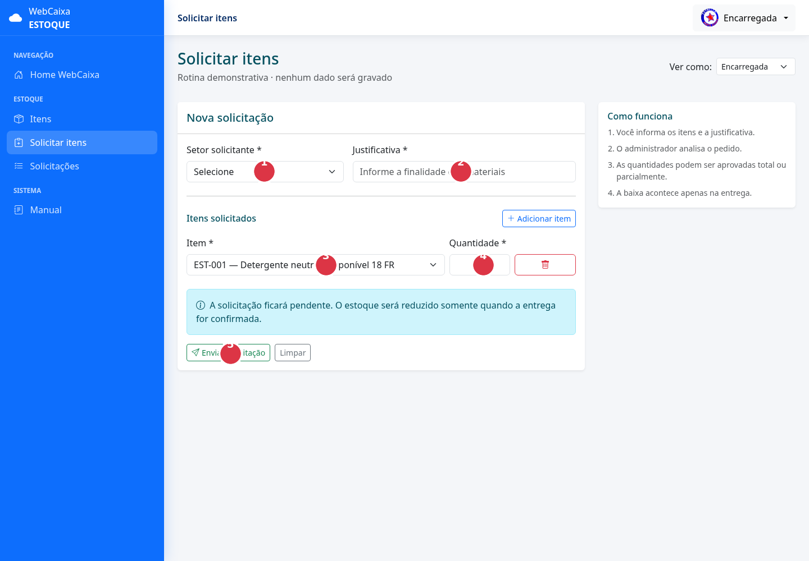

Siga os números:

1. Selecione o setor;
2. Escreva a justificativa;
3. Escolha o item;
4. Informe a quantidade;
5. Revise e envie.

1. Clique em **Solicitar itens**.
2. Escolha o setor.
3. Informe uma justificativa clara.
4. Selecione o item.
5. Informe a quantidade.
6. Adicione outros itens, se necessário.
7. Clique em **Enviar solicitação**.

Uma solicitação pendente não reserva nem reduz o saldo.

## 17. Acompanhar o pedido

A tela de detalhes mostra a evolução completa.

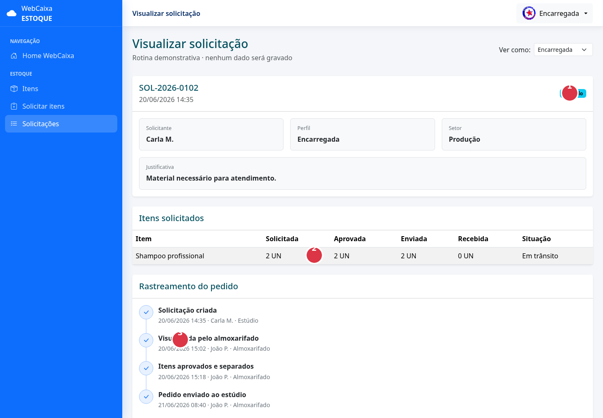

Na tela:

1. O status atual aparece no cabeçalho;
2. A tabela compara solicitado, aprovado, enviado e recebido;
3. A linha do tempo mostra quem executou cada etapa e quando.

Verifique:

- Se o almoxarifado visualizou;
- Se os itens foram aprovados;
- Se estão em separação;
- Se o pedido foi enviado;
- Quem executou cada etapa.

## 18. Confirmar recebimento

Quando o pedido chegar, não confirme antes da conferência física.

Siga o procedimento descrito na seção **23. Conferir o recebimento**.

---

# Parte III — Encarregada

## 19. Responsabilidades

A encarregada pode:

- Listar e visualizar os itens;
- Criar solicitações;
- Acompanhar suas solicitações;
- Confirmar o recebimento;
- Informar divergências.

Ela não pode cadastrar, editar, inativar, movimentar ou aprovar pedidos.

## 20. Consultar itens

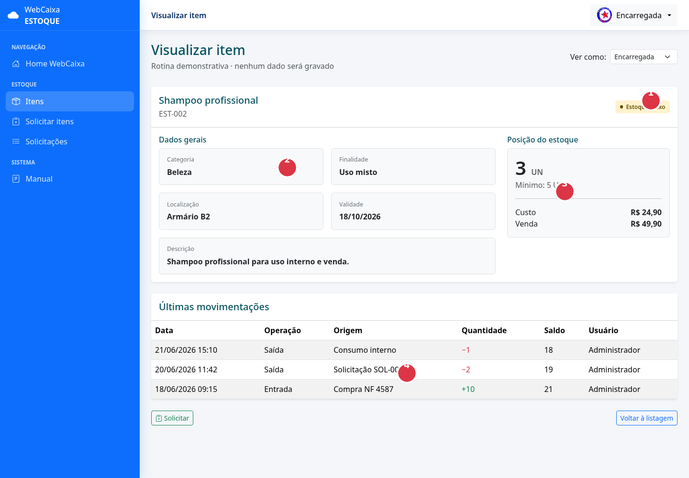

Ao visualizar:

1. Confira código e situação;
2. Leia categoria, finalidade, localização e descrição;
3. Confira saldo, estoque mínimo, custo e preço quando permitido;
4. Consulte as movimentações recentes.

1. Abra **Itens**.
2. Pesquise pelo nome ou código.
3. Use categoria, finalidade e situação.
4. Clique no ícone de olho para visualizar.

Antes de solicitar, confira:

- Saldo exibido;
- Unidade;
- Finalidade;
- Situação;
- Estoque mínimo.

O saldo apresentado não representa reserva.

## 21. Solicitar materiais


Os cinco marcadores mostram toda a operação: setor, justificativa, item,
quantidade e envio.

1. Clique em **Solicitar itens**.
2. Escolha o setor correto.
3. Explique a necessidade.
4. Selecione os itens.
5. Informe as quantidades.
6. Revise o pedido.
7. Envie.

Evite justificativas vagas como “preciso” ou “uso normal”. Prefira:

> Reposição de materiais para limpeza semanal da área de atendimento.

## 22. Saber se o pedido foi enviado

Abra a solicitação e confira a linha do tempo.

Quando houver o evento **Pedido enviado ao estúdio**, o pedido estará em
trânsito. A tela mostrará também:

- Data;
- Hora;
- Responsável pelo envio;
- Quantidade enviada.

## 23. Conferir o recebimento

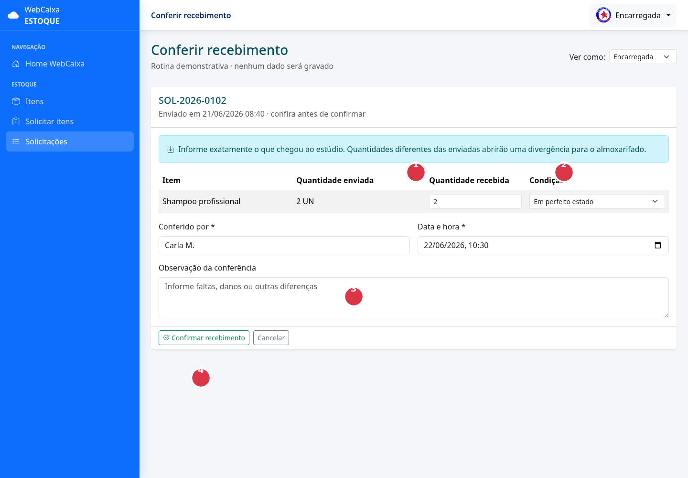

Na conferência:

1. Digite a quantidade que realmente chegou;
2. Informe a condição do material;
3. Descreva faltas, danos ou outras diferenças;
4. Confirme somente depois da contagem física.

1. Abra a solicitação enviada.
2. Clique em **Conferir recebimento**.
3. Conte cada item.
4. Informe a quantidade realmente recebida.
5. Selecione a condição:
   - Em perfeito estado;
   - Danificado;
   - Embalagem violada.
6. Informe quem conferiu.
7. Registre observações.
8. Clique em **Confirmar recebimento**.

### 23.1 Recebimento correto

Se o enviado for igual ao recebido:

```text
Enviado: 5
Recebido: 5
Resultado: solicitação concluída
```

### 23.2 Recebimento divergente

Se houver diferença:

```text
Enviado: 50
Recebido: 48
Diferença: 2
Resultado: aguardando almoxarifado
```

Nesse caso, detalhe a ocorrência. A solicitação não será encerrada até o
almoxarifado registrar o tratamento.

---

# Parte IV — Caixa

## 24. Responsabilidades

O caixa possui acesso somente para consulta.

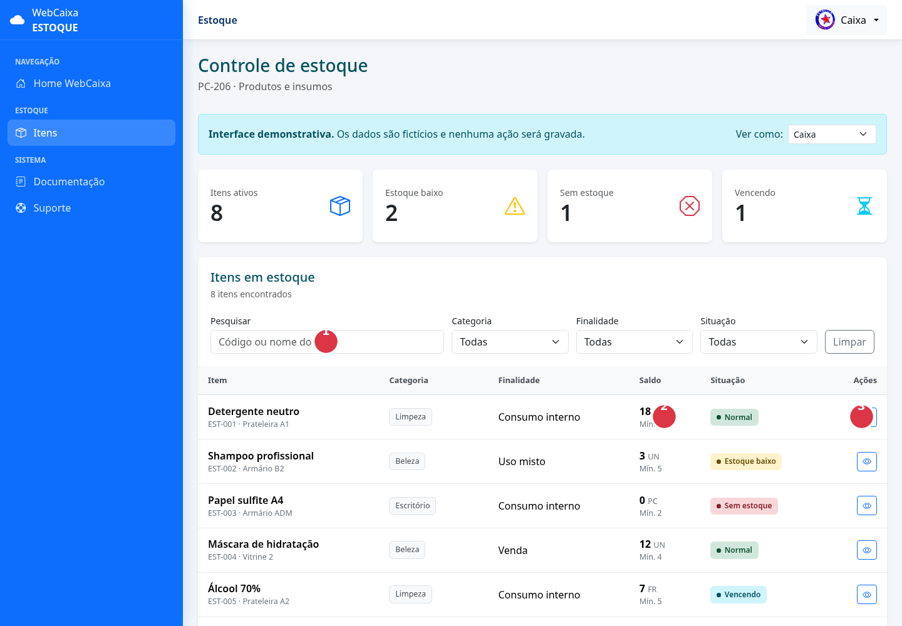

Para consulta:

1. Pesquise ou filtre;
2. Confira saldo e situação;
3. Use somente a ação de visualizar disponível ao perfil.

Pode:

- Listar itens;
- Pesquisar;
- Aplicar filtros;
- Visualizar os detalhes.

Não pode:

- Cadastrar;
- Editar;
- Inativar;
- Movimentar;
- Solicitar;
- Aprovar;
- Enviar;
- Confirmar recebimentos.

## 25. Consultar disponibilidade

1. Abra a rotina de estoque.
2. Pesquise o item.
3. Confira quantidade e situação.
4. Abra os detalhes se necessário.

O caixa não deverá interpretar o saldo como autorização para retirar
material. Retiradas devem seguir o fluxo definido pelo responsável.

---

## 26. Significado dos botões

| Ícone/cor | Ação |
|---|---|
| Olho azul | Visualizar |
| Prancheta verde | Solicitar |
| Lápis amarelo | Editar |
| Lixeira vermelha | Inativar |
| Caminhão | Registrar envio |
| Caixa com seta | Confirmar recebimento |
| Alerta vermelho | Tratar divergência |

Os botões aparecem conforme o perfil e o estado do pedido.

---

## 27. Regras importantes

### 27.1 Saldo

- Não editar saldo diretamente;
- Toda mudança deve gerar uma movimentação;
- Não permitir saldo negativo;
- Manter saldo anterior e posterior.

### 27.2 Pedidos

- Visualizar não significa aprovar;
- Aprovar não significa enviar;
- Enviar não significa receber;
- Recebimento deve refletir o que chegou fisicamente;
- Divergência não deve ser ignorada;
- Solicitações concluídas não podem ser apagadas.

### 27.3 Auditoria

- Não apagar eventos;
- Não substituir histórico;
- Corrigir por nova movimentação;
- Registrar usuário, data e justificativa.

### 27.4 Segurança

- Não compartilhe senha;
- Não deixe a sessão aberta;
- Confirme o perfil exibido;
- Não use credenciais de outro funcionário;
- Saia do sistema ao finalizar.

---

## 28. Perguntas frequentes

### A solicitação reduz o estoque?

Não. Criar ou aprovar uma solicitação não reduz automaticamente o saldo.

### Quando o estúdio sabe que o almoxarifado viu o pedido?

Quando o almoxarifado abre a solicitação, o evento de visualização é
registrado na linha do tempo.

### Quando o estúdio sabe que o pedido saiu?

Depois que o almoxarifado confirma o envio. O pedido passa para **Enviado**.

### O estúdio pode confirmar uma quantidade menor?

Sim. Isso abre uma divergência.

### Quem encerra uma divergência?

O almoxarifado, após informar o tratamento.

### O almoxarifado precisa confirmar todo recebimento?

Não. Se enviado e recebido forem iguais, o sistema conclui automaticamente.
A confirmação do almoxarifado é exigida quando existe divergência.

### Um item pode ser apagado?

A orientação é inativar, preservando movimentações e auditoria.

### O caixa pode solicitar material?

Não, conforme a matriz de permissões definida.

---

## 29. Procedimento em caso de erro

Se ocorrer um erro:

1. Não repita a operação várias vezes;
2. Anote a tela e o número da solicitação;
3. Registre data e horário;
4. Tire uma captura da mensagem;
5. Informe o perfil utilizado;
6. Acione o suporte.

Nunca tente corrigir uma divergência excluindo registros.

---

## 30. Resumo rápido por perfil

| Atividade | Administrador/Almoxarifado | Auditoria | Encarregada | Caixa |
|---|---:|---:|---:|---:|
| Cadastrar | Sim | Não | Não | Não |
| Editar | Sim | Sim | Não | Não |
| Visualizar | Sim | Sim | Sim | Sim |
| Inativar | Sim | Não | Não | Não |
| Movimentar | Sim | Não | Não | Não |
| Solicitar | Sim | Sim | Sim | Não |
| Aprovar | Sim | Não | Não | Não |
| Registrar envio | Sim | Não | Não | Não |
| Confirmar recebimento | Não | Sim | Sim | Não |
| Tratar divergência | Sim | Não | Não | Não |
| Consultar histórico | Sim | Sim | Não | Não |

---

## 31. Glossário

- **Almoxarifado:** setor responsável por armazenar e enviar itens;
- **Estúdio:** unidade que solicita e recebe materiais;
- **Movimentação:** evento que altera o saldo;
- **Estoque mínimo:** quantidade usada para gerar alerta;
- **Solicitação:** pedido de materiais;
- **Quantidade aprovada:** quantidade autorizada;
- **Quantidade enviada:** quantidade que saiu do almoxarifado;
- **Quantidade recebida:** quantidade conferida pelo estúdio;
- **Divergência:** diferença ou problema entre envio e recebimento;
- **Inativação:** retirada do item das operações, preservando o histórico.

---

## 32. Situação atual do projeto

O manual documenta o comportamento planejado e as telas simuladas. Antes da
implantação real ainda será necessário:

- Criar as tabelas do banco;
- Integrar formulários e serviços;
- Substituir dados fictícios;
- Aplicar notificações;
- Testar concorrência e transações;
- Homologar os fluxos com os usuários;
- Treinar cada perfil.
